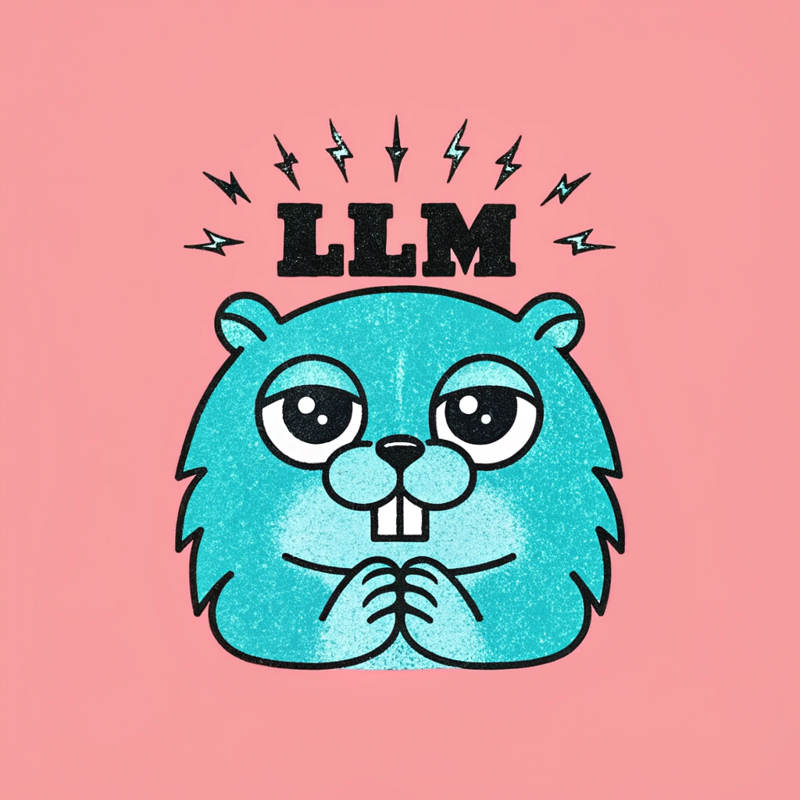

# llm



[](https://pkg.go.dev/maragu.dev/llm)
[](https://github.com/maragudk/llm/actions/workflows/ci.yml)

LLM tools and helpers in Go.

⚠️ **This library is in development**. Things will probably break, but existing functionality is usable. ⚠️

```shell
go get maragu.dev/llm
```

Made with ✨sparkles✨ by [maragu](https://www.maragu.dev/).

Does your company depend on this project? [Contact me at markus@maragu.dk](mailto:markus@maragu.dk?Subject=Supporting%20your%20project) to discuss options for a one-time or recurring invoice to ensure its continued thriving.

## Usage

This test will only run with `go test -run TestEval ./...` and otherwise be skipped:

```go
package examples_test

import (
	"testing"

	"maragu.dev/llm/eval"
)

// TestEvalPrompt evaluates the Prompt method.
// All evals must be prefixed with "TestEval".
func TestEvalPrompt(t *testing.T) {
	// Evals only run if "go test" is being run with "-test.run=TestEval", e.g.: "go test -test.run=TestEval ./..."
	eval.Run(t, "answers with a pong", func(e *eval.E) {
		// Initialize our intensely powerful LLM.
		llm := &llm{response: "plong"}

		// Send our input to the LLM and get an output back.
		input := "ping"
		output := llm.Prompt(input)

		// Create a sample to pass to the scorer.
		sample := eval.Sample{
			Expected: "pong",
			Input:    input,
			Output:   output,
		}

		// Score the sample using the Levenshtein distance scorer.
		// The scorer is created inline, but for scorers that need more setup, this can be done elsewhere.
		result := e.Score(sample, eval.LevenshteinDistanceScorer())

		// Log the result to stdout.
		e.Log(result)
	})
}

type llm struct {
	response string
}

func (l *llm) Prompt(request string) string {
	return l.response
}
```
